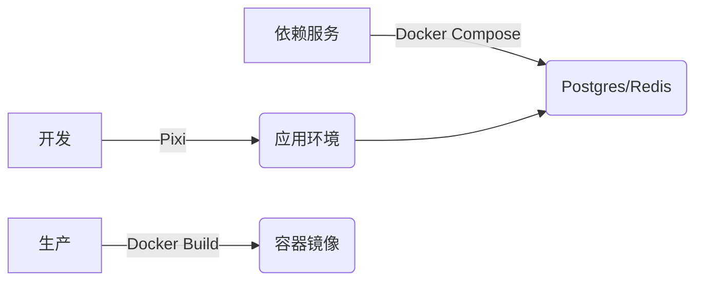

> 整理自 2025 年 12 月的系列对话  
> 目标：厘清现代 Python 开发中各类环境管理工具的定位、区别与最佳实践

---

## 一、Docker 常用操作速查

### 镜像（Image）相关

| 操作     | 命令                               |
| ------ | -------------------------------- |
| 列出本地镜像 | `docker images`                  |
| 拉取镜像   | `docker pull <image-name>[:tag]` |
| 构建镜像   | `docker build -t <image-name> .` |
| 删除镜像   | `docker rmi <image-id>`          |


### 容器（Container）相关

|操作|命令|
|---|---|
|列出容器|`docker ps`（运行中） / `docker ps -a`（全部）|
|启动/停止|`docker start/stop <container>`|
|进入容器|`docker exec -it <container> /bin/bash`|
|查看日志|`docker logs [-f] <container>`|

### 常用参数

```bash
docker run -d --name my-app -p 8080:3000 -v $(pwd):/app my-image
```

- `-d`：后台运行
- `-p host:container`：端口映射
- `-v /host:/container`：挂载卷（开发热更新）
- `--rm`：退出后自动删除

### Docker Compose（多服务编排）

- `docker-compose up -d`：启动服务栈
- `docker-compose down`：停止并清理

---

## 二、Docker 的本质与常见误区

### 误区 1：Docker 容器是一个完整操作系统

 **事实**：容器**共享宿主机 Linux 内核**，仅包含应用及其依赖（用户空间），**不是虚拟机**。

### 误区 2：个人开发没必要用 Docker，只适合迁移

 **事实**：Docker 在**个人开发中价值极高**：

- 解决“在我机器上能跑”问题
- 快速搭建复杂依赖（DB、缓存、消息队列）
- 多项目环境隔离
- 模拟生产架构
- 避免污染本机环境

>  Docker 的核心价值：**消除“环境”这个变量**，实现开发 → 测试 → 生产一致性。

---

## 三、子项目依赖父目录？如何用 Docker？

### 场景

```
project/
├── shared/               ← 共享代码
└── apps/my-app/          ← 子项目（含 Dockerfile）
```

###  正确做法：从项目根目录构建

```Dockerfile
# Dockerfile（可放在子目录）
FROM python:3.11
WORKDIR /app
COPY shared/ ./shared/
COPY apps/my-app/ ./my-app/
WORKDIR /app/my-app
CMD ["python", "app.py"]
```

```bash
# 在 project/ 根目录执行
docker build -f apps/my-app/Dockerfile -t my-app .
```

>  关键：**构建上下文（build context）必须包含所有依赖文件**

---

## 四、Docker vs 虚拟环境（venv）

|维度|虚拟环境（venv）|Docker|
|---|---|---|
|**隔离层级**|语言包级别（仅 Python）|操作系统用户空间级别|
|**支持语言**|单一语言|任意语言|
|**系统依赖**|依赖宿主机|自包含（镜像中自带）|
|**跨平台一致性**|弱|强|
|**适合场景**|单语言脚本|多服务、复杂依赖、团队协作|

> **虚拟环境 = 独立工具箱**  
> **Docker = 独立微型工厂**

---

## 五、uv 虚拟环境 vs 传统 venv

### 核心优势

- **速度极快**：创建虚拟环境 50~100ms（比 `venv` 快 10~50 倍）
- **完全兼容**：生成标准 `venv` 结构，IDE 可识别
- **智能 Python 发现**：自动扫描系统所有 Python 版本
- **超快包安装**：`uv pip install` 比官方 `pip` 快 10~100 倍

### 使用方式

```bash
# 创建
uv venv                # 默认 .venv
uv venv --python 3.11  # 指定版本

# 安装依赖
uv pip install flask
uv pip compile requirements.in > requirements.txt  # 生成 lock
uv pip sync requirements.txt                       # 精确同步
```

>  **uv 不是新虚拟环境格式，而是更快、更智能的 venv 创建器 + 包管理器**

---

## 六、uv vs Conda：是否还需要 Conda？

### 核心区别

|工具|设计目标|管理范围|
|---|---|---|
|**uv**|超高速 Python 包管理|仅 PyPI（Python 生态）|
|**Conda**|跨语言科学计算平台|Python + R + C/C++ 库 + 系统工具（CUDA, gcc）|

### 何时用 uv？

- Web 开发（Django/Flask）
- 纯 Python 脚本
- 追求速度和现代工具链

### 何时用 Conda？

- 机器学习（PyTorch + CUDA）
- 数据科学（scipy, xgboost）
- 科学计算（numba, h5py）
- 多语言项目（Python + R）

>  **不要混用！**
> 
> - 在 Conda 环境中用 `uv pip install` 安装含 C 扩展的包 → **极易崩溃**
> - 原则：**一个项目只用一套工具链**

---

## 七、Pixi：Conda 的现代化替代品

### 定位

- 由 `uv` 同团队（Prefix.dev）开发
- 结合 Conda 的**跨语言包生态** + `uv` 的**速度与体验**
- 使用 `conda-forge` 作为包源，但用 Rust 重写解析器

### 能力（截至 2025 年 12 月）

-  跨平台（macOS/Windows/Linux）
-  多语言支持（Python/R/Node.js/C++/Julia）
-  CUDA / Apple Silicon 支持
-  精确 lockfile（`pixi.lock`）
-  任务系统（`pixi task` 替代 Makefile）

### 是否稳定？

- **高度可用**：已被科研机构和工业团队采用
- **仍在快速迭代**：v0.x 阶段可能有小的配置变更
- **推荐用于**：AI、科研、数据科学等交叉领域项目

### 安装与使用

```bash
# 安装
curl -fsSL https://pixi.sh/install.sh | bash

# 初始化
pixi init
pixi add python=3.11 numpy pytorch cudatoolkit=12.1

# 运行
pixi run python train.py
```

---

## 八、Pixi 能替代 Docker 吗？

###  可替代的场景（开发阶段）

- 本地开发环境搭建（比 Docker 更快、GPU 开箱即用）
- 科研实验可复现性（精确锁定所有依赖）
- CI/CD 测试（比 Docker 构建更快）

### 无法替代的场景

- **完整服务依赖**：Pixi 只安装客户端（如 `psql`），不启动 PostgreSQL 服务
- **强隔离/安全**：无内核级隔离
- **生产部署**：云平台要求容器镜像
- **微服务架构**：无法实现服务解耦

### 最佳实践：协同使用



> 🌟 **Pixi 负责“开发体验”，Docker 负责“部署标准化”**

---

## 九、总结：工具选型指南

| 项目类型              | 推荐工具链                                  |
| ----------------- | -------------------------------------- |
| **Web 后端 / 脚本**   | `uv` + 系统 Python                       |
| **数据科学 / ML（本地）** | `Pixi`（或 Conda）                        |
| **ML（需生产部署）**     | `Pixi`（开发） + `Docker`（部署）              |
| **多服务应用**         | `Docker Compose`（服务） + `uv`/`Pixi`（应用） |
| **科研可复现**         | `Pixi`（首选）或 `Docker`                   |

> **核心原则**：
> 
> 1. **不要混用 Conda 和 uv/pip**
> 2. **开发追求速度与体验 → uv / Pixi**
> 3. **部署追求标准化与隔离 → Docker**
> 4. **工具服务于需求，不是反过来**